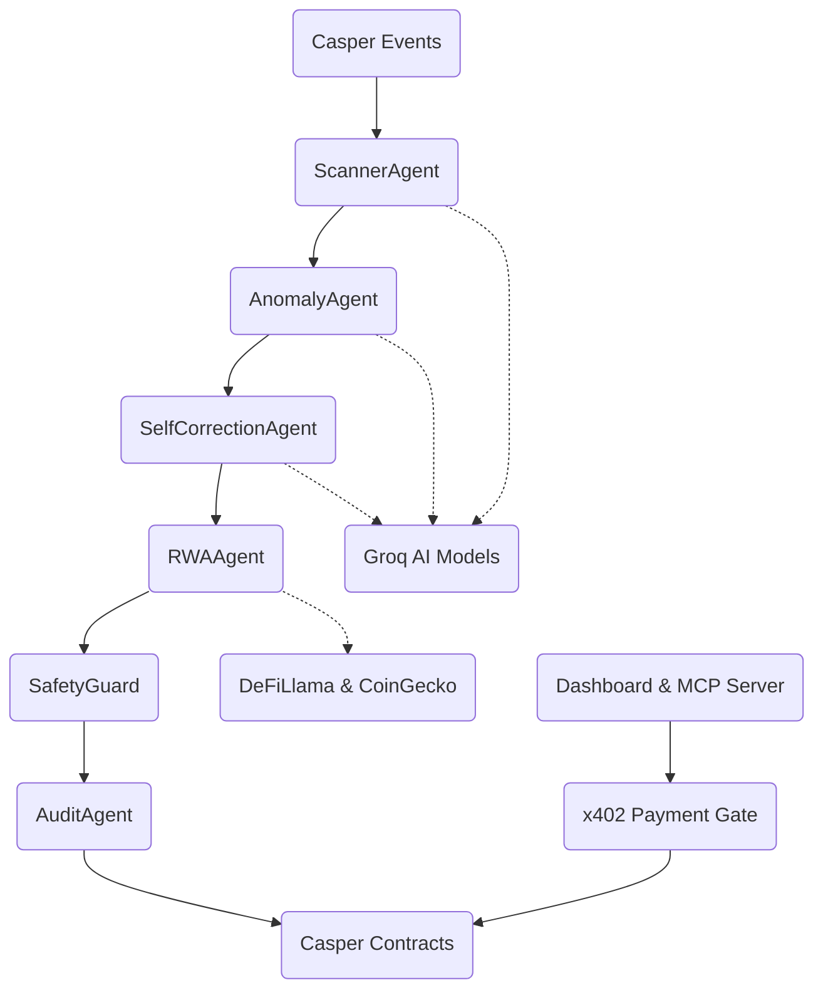

# 🛡️ VaultWatch

**AI-Powered DeFi Risk Intelligence on Casper**


[Demo](#quick-start) | [Contracts](#3-live-contracts-on-casper-testnet) | [Dashboard](#quick-start) | [MCP Server](#8-mcp-server-for-claudellms)

## What is VaultWatch?

VaultWatch provides real-time DeFi risk monitoring on the Casper Network. Our platform proactively scans DeFi activities, analyzes anomalies, and identifies potential risks, providing actionable intelligence to secure digital assets.

At the core of VaultWatch is a sophisticated **6-layer AI agent pipeline** (Scanner → Anomaly → SelfCorrection → RWA → SafetyGuard → Audit). This pipeline ensures highly accurate risk assessments and minimizes false positives by systematically evaluating data, cross-referencing with real-world assets (RWA), and passing through a rigorous safety guard before finalizing the audit.

VaultWatch monetizes this intelligence using a cutting-edge **Pay-per-query intelligence model via the x402 HTTP 402 protocol**. Users pay micro-transactions per query to access premium risk intelligence. The findings are stored immutably on-chain via **8 Odra smart contracts**, ensuring transparency, verifiability, and tamper-proof records.

## Live Contracts on Casper Testnet

All 8 smart contracts are deployed and verified on the Casper Testnet.

Deployer: `0203cd257525b180a32cab4efc0d9d9a365bf9bc1b8d2e76ebfb9186a4eeb23bace7`

| Contract | Deploy Hash | Explorer |
|----------|-------------|----------|
| AuditTrail | b9c70cdceff1011008b3933835d4a46146f26f1d1e82ada8520be77e1d6336a7 | [View](https://testnet.cspr.live/deploy/b9c70cdceff1011008b3933835d4a46146f26f1d1e82ada8520be77e1d6336a7) |
| SentinelRegistry | 9a5eb4f83de8cbfef4f389516b977258b0e1d63179b288ca623a860fc6ec346c | [View](https://testnet.cspr.live/deploy/9a5eb4f83de8cbfef4f389516b977258b0e1d63179b288ca623a860fc6ec346c) |
| RiskOracle | e071aacc460a62e538092f5006930710f49e632598846c4c843e3daf0c5a7c9d | [View](https://testnet.cspr.live/deploy/e071aacc460a62e538092f5006930710f49e632598846c4c843e3daf0c5a7c9d) |
| SentinelCredit | 0c09f2ad66701b38b1720390e20bf8ac5b7bf6a20cc174cba44f3861549baf71 | [View](https://testnet.cspr.live/deploy/0c09f2ad66701b38b1720390e20bf8ac5b7bf6a20cc174cba44f3861549baf71) |
| AgentBehaviorIndex | 05066c33ddb73b523ab8f67275ca6096254f9d1832e76075d1e5f41f188b7dd0 | [View](https://testnet.cspr.live/deploy/05066c33ddb73b523ab8f67275ca6096254f9d1832e76075d1e5f41f188b7dd0) |
| SentinelAlertLog | 53317e080ffdffcf097447ea3375c9195c6936fe7b1ed53795bf46134322a925 | [View](https://testnet.cspr.live/deploy/53317e080ffdffcf097447ea3375c9195c6936fe7b1ed53795bf46134322a925) |
| RiskPolicyManager | 93e35d6488dcab8524a22c82241c7ddc6d07b0f7c011544e6c4a296c1a0eee2e | [View](https://testnet.cspr.live/deploy/93e35d6488dcab8524a22c82241c7ddc6d07b0f7c011544e6c4a296c1a0eee2e) |
| SubscriberVault | 6620787c14d9d78506b281be8c95c8f9b105781b9705d2bd9736f2aabfd6956d | [View](https://testnet.cspr.live/deploy/6620787c14d9d78506b281be8c95c8f9b105781b9705d2bd9736f2aabfd6956d) |

## Architecture



## The 6-Layer Agent Pipeline

1. **ScannerAgent**
   - **Model:** `llama-3.1-8b-instant`
   - **Flow:** Raw Casper Events → Structured Tx Data
   - **Key Fix:** Event parsing logic improvements

2. **AnomalyAgent**
   - **Model:** `llama-3.3-70b-versatile`
   - **Flow:** Structured Tx Data → Initial Threat Assessment
   - **Key Fix:** Heuristics adjustments for Casper

3. **SelfCorrectionAgent**
   - **Model:** `llama-3.3-70b-versatile`
   - **Flow:** Threat Assessment → Adjusted Assessment
   - **Key Fix:** Fix #10: reads live policy from RiskPolicyManager

4. **RWAAgent**
   - **Model:** `compound-beta` / DeFiLlama APIs
   - **Flow:** Adjusted Assessment → RWA Context
   - **Key Fix:** Fix #28: real data sources

5. **SafetyGuard**
   - **Model:** `llama-prompt-guard-2-86m`
   - **Flow:** Content + RWA Context → Safety Validation
   - **Key Fix:** Fix #14: fail-closed (returns `approved=False` on exception)

6. **AuditAgent**
   - **Model:** `llama-3.1-8b-instant`
   - **Flow:** Validated Assessment → On-Chain Audit
   - **Key Fix:** Fix #4: record_finding entry point integration

## Security Model

Security is at the heart of VaultWatch. We've implemented robust security measures at every level:

- **Fix #6:** No API keys in client bundle — CSPR.cloud proxied through `/api/chain`.
- **Fix #7:** Groq key server-side only.
- **Fix #14:** SafetyGuard fail-closed (exception → `approved=False`).
- **Fix #16:** X-API-Key auth + slowapi rate limiting on backend APIs.
- **Fix #25:** RBAC roles (`OPERATOR`/`ADMIN`/`PAUSER`) enforced in RiskPolicyManager.
- **Fix #8:** `SentinelCredit.deposit` is `#[odra(payable)]` processing real CSPR transfers.

## x402 Pay-Per-Query Intelligence

VaultWatch monetizes its intelligence API using the x402 HTTP 402 protocol, establishing a pay-per-query model.
- **Endpoint:** `GET /api/intel`
- **Without payment:** Returns `HTTP 402 Payment Required` with payment parameters.
- **With `X-Payment` header:** Payment is verified, and returns the requested intelligence findings.
- **Price:** 1 CSPR per standard query, 5 CSPR for CRITICAL-only queries.
- **Code reference:** `api/main.py` → `_build_402_response()`, `_verify_x402_payment()`
- **TypeScript client:** `x402/vaultwatch-x402.ts`

## MCP Server (for Claude/LLMs)

You can run our FastMCP server to integrate with LLMs:
```bash
npx vaultwatch-mcp
```
- Includes 20 tools like `risk_scan`, `rwa_context`, `safety_check`, `policy_hotswap`, etc.
- Tools connect to real Casper testnet RPC.
- Configurable via `CASPER_RPC_URL` and contract hashes environment variables.

## Quick Start

```bash
# Clone
git clone https://github.com/sodiq-code/vaultwatch
cd vaultwatch

# Install Python deps
pip install -r requirements.txt

# Configure environment
cp .env.example .env
# Edit .env with your GROQ_API_KEY and CASPER keys

# Start API
uvicorn api.main:app --reload

# Start Dashboard  
cd dashboard && npm install && npm run dev
```

## Python SDK

```python
from vaultwatch import VaultWatchClient
client = VaultWatchClient()

# Get latest findings from AuditTrail contract
findings = await client.audit_trail.get_all_findings(limit=10)

# Get current risk policy from RiskPolicyManager contract
policy = await client.policy_manager.get_current_policy()

# Get credit balance
balance = await client.sentinel_credit.get_balance("your-address")
```

## Testing

```bash
# Unit tests
pytest tests/ -v

# E2E tests against Casper testnet (requires CASPER_E2E=1)
CASPER_E2E=1 pytest tests/e2e/ -v

# TypeScript type check
cd x402 && tsc --noEmit
```

## Project Structure

```
vaultwatch/
├── agents/        # 6-layer AI pipeline implementation
├── api/           # x402 enabled backend API server
├── contracts/     # Odra smart contracts for Casper
├── dashboard/     # React frontend interface
├── docs/          # Architecture and design documentation
├── proof/         # On-chain deployment verification
├── tests/         # Unit and E2E test suites
└── x402/          # TypeScript client for HTTP 402 protocol
```

## Key Files Reference Table

| Claim | File | Key Lines |
|-------|------|-----------|
| SafetyGuard fail-closed | `agents/safety_guard.py` | except block → `approved=False` |
| x402 gate | `api/main.py` | `_build_402_response()` |
| Payable deposit | `contracts/src/sentinel_credit.rs` | `#[odra(payable)]` |
| RBAC roles | `contracts/src/risk_policy_manager.rs` | `OPERATOR`/`ADMIN`/`PAUSER` |
| Live RWA data | `agents/rwa_agent.py` | DeFiLlama + `compound-beta` |
| No client API keys | `dashboard/src/liveApi.js` | API_BASE proxy only |

## Roadmap

- [ ] Mainnet deployment
- [ ] Chainlink price feed oracle integration
- [ ] Multi-chain support (EVM via x402)
- [ ] DAO governance via RiskPolicyManager
- [ ] VaultWatch API marketplace

## License & Credits

- MIT License
- Built for Casper Network Buildathon
- Powered by: Groq AI, Odra Framework, FastMCP, x402 Protocol
